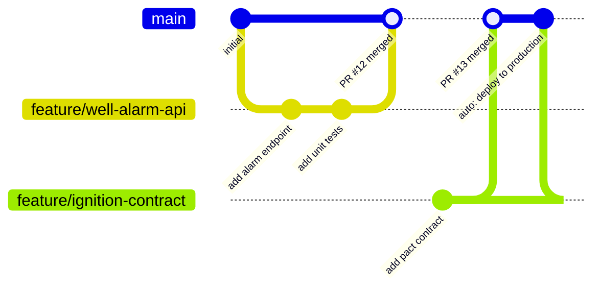
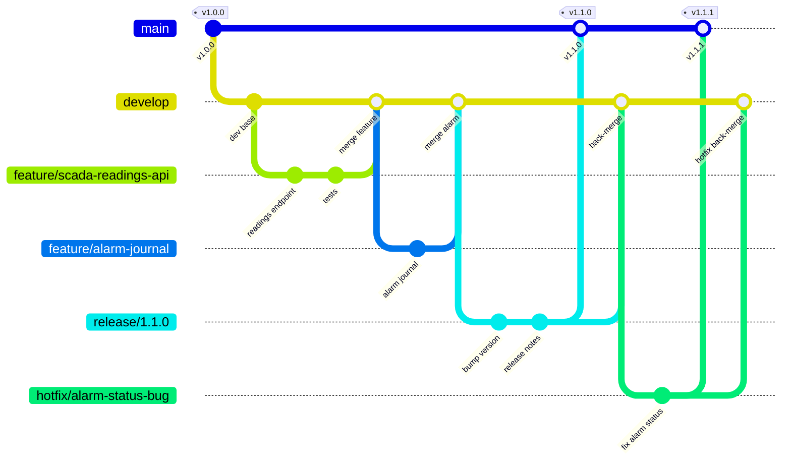
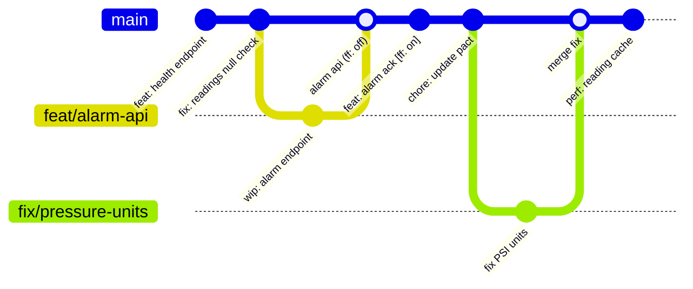

# Well Monitoring Service - CI/CD Demo
**Fuel Energy Corp · Platform Engineering**

A production-grade CI/CD reference implementation for oil & gas operations. This repository demonstrates how a **SCADA-integrated microservice** - consumed by Ignition and field operations dashboards - can be developed, tested, and deployed through a fully automated pipeline with quality gates and manual approval controls.

---

## Table of Contents

1. [Architecture Overview](#architecture-overview)
2. [Branching Strategies](#branching-strategies)
   - [GitHub Flow](#1-github-flow)
   - [Git Flow](#2-git-flow)
   - [Trunk Based Development](#3-trunk-based-development)
   - [Which Strategy Are We Using?](#which-strategy-are-we-using)
3. [CI/CD Pipeline](#cicd-pipeline)
4. [Sample Application](#sample-application)
5. [Contract Testing](#contract-testing)
6. [Performance Testing](#performance-testing)
7. [Running Locally](#running-locally)

---

## Architecture Overview

```
  Field Devices (RTUs / PLCs)
          │  Modbus / OPC-UA
          ▼
  ┌───────────────────┐
  │  Ignition SCADA   │  ← Inductive Automation
  │  (Tag Engine)     │
  └────────┬──────────┘
           │  REST (poll + push)
           ▼
  ┌────────────────────────────┐
  │  Well Monitoring Service   │  ← This repository
  │  (FastAPI · Python 3.12)   │
  └────────┬───────────────────┘
           │
     ┌─────┴──────┐
     │            │
  NOC          Production
  Dashboard    Engineering
  (read)       Tools (read)
```

**In production**, the Well Monitoring Service would run on a compute target (ECS / Azure App Service / Kubernetes cluster - TBD based on infrastructure decision), backed by an OSIsoft PI historian for time-series data and a relational well registry.

---

## Branching Strategies

Three strategies are commonly adopted for software teams in O&G and industrial automation. Each has different trade-offs in terms of complexity, release cadence, and suitability for regulated environments.

---

### 1. GitHub Flow

The simplest strategy. There is one long-lived branch (`main`) and short-lived feature branches. Merging a feature branch to `main` triggers an immediate deployment.

**Best for:** Small teams, fast release cadence, SaaS products, continuous delivery.



**Workflow:**
1. Branch off `main` → `feature/<name>` or `fix/<name>`
2. Open a Pull Request - triggers automated PR checks (lint, unit tests, contract tests)
3. Peer review and approval
4. Merge to `main` → triggers the full CI/CD pipeline (test → staging → performance → production)

**Pros:**
- Minimal process overhead
- Every merge to `main` is a deployable artefact
- Easy to reason about - one branch = production truth

**Cons:**
- Requires strong feature flag discipline for incomplete work
- Not naturally suited to environments requiring a distinct QA/UAT gate before production
- Release timing is implicit (every merge deploys)

---

### 2. Git Flow

A more structured strategy with two long-lived branches (`main` for production, `develop` for integration) and supporting branches for features, releases, and hotfixes.

**Best for:** Teams with scheduled release cycles, regulatory environments (e.g., IEC 62443 / ISA-95), or where production deployments require formal change approval.



**Branch types:**

| Branch | Purpose | Lifetime |
|--------|---------|----------|
| `main` | Production-ready code. Tagged releases only. | Permanent |
| `develop` | Integration branch. All features merge here first. | Permanent |
| `feature/*` | New functionality. Branches off `develop`. | Short (days-weeks) |
| `release/*` | Stabilisation before production. QA/UAT happens here. | Medium (days) |
| `hotfix/*` | Emergency production fixes. Branches off `main`. | Short (hours) |

**Pros:**
- Explicit staging/release process - suits change management boards
- Clear separation between in-flight work and production code
- Hotfix path is well-defined and doesn't disrupt active development

**Cons:**
- Higher cognitive overhead - multiple long-lived branches
- Merge conflicts accumulate on long-running feature branches
- Slow feedback loop for developers (work doesn't reach `main` for days/weeks)
- Overkill for small, fast-moving teams

---

### 3. Trunk Based Development

Developers commit directly to `main` (the "trunk") multiple times per day, or use extremely short-lived branches (< 24 hours). Incomplete features are hidden behind feature flags rather than kept on long branches.

**Best for:** High-performing engineering teams with strong CI discipline, extensive automated test coverage, and a culture of continuous integration.



**Key principles:**

- **Feature flags**: Incomplete or risky features are merged to trunk but toggled off in production. Enables independent deployment of code and features.
- **Short-lived branches**: If branches are used, they are never more than 1-2 days old. Stale branches are a smell.
- **Comprehensive CI**: Every commit to trunk triggers a full test suite. A broken trunk is the highest priority incident.
- **Release from trunk**: Any commit on trunk is potentially releasable. Tags mark formal releases.

**Pros:**
- Fastest feedback loop - integration issues surface within hours
- Eliminates long-lived merge hell
- Forces a culture of small, incremental, always-working changes
- Highly compatible with continuous delivery

**Cons:**
- Requires discipline and feature flag infrastructure
- Not suitable without strong automated test coverage (risk of broken trunk)
- Cultural shift required - not everyone is comfortable committing daily to shared trunk
- Feature flag debt accumulates if flags are not cleaned up

---

### Which Strategy Are We Using?

**This demo uses GitHub Flow** - the simplest strategy that maps directly to our pipeline:

```
feature branch  →  PR (automated checks)  →  merge to main  →  CI/CD pipeline
```

| Pipeline Stage | Trigger |
|---|---|
| Lint, Unit Tests, Contract Tests | Pull Request opened / updated |
| Full CI/CD (build → stg → perf → prd) | Push to `main` (PR merged) |

> In a production O&G environment - where deployments may require a formal Management of Change (MOC) process or ISA/IEC compliance sign-off - **Git Flow** would be the more appropriate choice, with the `release/*` branch mapping to the MOC/change window and the production approval gate serving as the digital equivalent of a work permit.

---

## CI/CD Pipeline

```
push to main
    │
    ▼
┌──────────┐
│  build   │  Docker image built & tagged with git SHA
└────┬─────┘
     │
     ├──────────────────────────┐
     ▼                          ▼
┌───────────────┐    ┌──────────────────────┐
│  unit-tests   │    │    (parallel)        │
│  (pytest)     │    │                      │
└───────┬───────┘    └──────────────────────┘
        │
        ▼
┌───────────────────────────────┐
│  contract-tests               │
│  Pact provider verification   │
│  Consumer: SCADA-Ignition     │
│  Provider: WellMonitoringService│
└───────────────┬───────────────┘
                │
                ▼
┌───────────────────────────────┐
│  deploy-staging               │
│  ● Rolling update (simulated) │
│  ● https://api-stg.fuel-      │
│    energy.com                 │
└───────────────┬───────────────┘
                │
                ▼
┌───────────────────────────────┐
│  performance-tests            │
│  k6 · 3 scenarios             │
│  ● NOC dashboard polling      │
│  ● Ignition tag push          │
│  ● Alarm burst simulation     │
│  Threshold: p95 < 500ms       │
└───────────────┬───────────────┘
                │
                ▼
┌───────────────────────────────┐
│  deploy-production            │  ← 🔐 Manual approval required
│  ● Blue/green deployment      │     (Platform Engineering lead
│  ● Traffic canary shift       │      or NOC supervisor)
│  ● https://api.fuel-energy.com│
└───────────────┬───────────────┘
                │
                ▼
┌───────────────────────────────┐
│  smoke-tests-production       │
│  ● 5 endpoint checks          │
│  ● NOC notification           │
└───────────────────────────────┘
```

### Quality Gates

| Gate | Threshold | Blocks |
|------|-----------|--------|
| Unit test coverage | ≥ 80% | Staging deploy |
| Pact contract verification | All interactions pass | Staging deploy |
| k6 p95 response time | < 500ms | Production deploy |
| k6 error rate | < 1% | Production deploy |
| Production smoke tests | All pass | Pipeline success |
| Manual approval | Designated reviewer | Production deploy |

---

## Sample Application

**Well Monitoring Service** - a REST API that serves as the integration point between Ignition SCADA and downstream consumers (NOC dashboards, production engineering tools).

### Endpoints

| Method | Path | Description |
|--------|------|-------------|
| `GET` | `/api/v1/wells` | List all wells (filterable by status, field) |
| `GET` | `/api/v1/wells/{id}` | Get a single well |
| `POST` | `/api/v1/wells` | Register a new well |
| `PATCH` | `/api/v1/wells/{id}/status` | Update well operational status |
| `GET` | `/api/v1/wells/{id}/readings` | Get sensor reading history |
| `GET` | `/api/v1/wells/{id}/readings/latest` | Get latest SCADA reading |
| `POST` | `/api/v1/wells/{id}/readings` | Push a reading from Ignition |
| `GET` | `/api/v1/wells/{id}/alarms` | Get alarms (filterable by status) |
| `POST` | `/api/v1/wells/{id}/alarms` | Trigger alarm from Ignition tag event |
| `PATCH` | `/api/v1/wells/{id}/alarms/{alm}/acknowledge` | NOC operator acknowledgement |
| `PATCH` | `/api/v1/wells/{id}/alarms/{alm}/resolve` | Mark alarm resolved |
| `GET` | `/health` | Service health check |

### Seeded Data

| Well ID | Name | Field | Status |
|---------|------|-------|--------|
| WELL-001 | Permian Alpha-1 | Permian Basin | Active |
| WELL-002 | Permian Alpha-2 | Permian Basin | Active |
| WELL-003 | Eagle Ford Beta-1 | Eagle Ford Shale | Maintenance |
| WELL-004 | Bakken Delta-3 | Williston Basin | **Alarm** (high-pressure) |

### Sensor Reading Schema

```json
{
  "well_id": "WELL-001",
  "timestamp": "2026-03-29T06:00:00",
  "wellhead_pressure_psi": 2340.5,
  "casing_pressure_psi": 1850.0,
  "tubing_pressure_psi": 2100.3,
  "flow_rate_bopd": 412.7,
  "gas_oil_ratio": 850.0,
  "water_cut_pct": 12.4,
  "temperature_f": 148.2,
  "choke_size_64th": 24
}
```

---

## Contract Testing

Contract testing ensures the Well Monitoring Service never breaks its consumers without their knowledge - critical in an O&G environment where a broken API can mean Ignition loses visibility into field conditions.

**Approach: Consumer-Driven Contract Testing (Pact)**

```
┌─────────────────────┐         ┌────────────────────────────┐
│   SCADA-Ignition    │         │  WellMonitoringService     │
│   (Consumer)        │         │  (Provider)                │
│                     │         │                            │
│  Defines what it    │──pact──▶│  Verifies it can fulfil    │
│  expects from the   │         │  every interaction in      │
│  provider API       │         │  the pact                  │
└─────────────────────┘         └────────────────────────────┘
```

**Pact interactions covered:**

| # | Interaction | Consumer State |
|---|-------------|----------------|
| 1 | `GET /api/v1/wells?status=active` | Active wells exist |
| 2 | `GET /api/v1/wells/WELL-001/readings/latest` | WELL-001 has readings |
| 3 | `POST /api/v1/wells/WELL-001/readings` | WELL-001 is active |
| 4 | `POST /api/v1/wells/WELL-001/alarms` | WELL-001 is active |
| 5 | `GET /api/v1/wells/WELL-004/alarms?status=active` | WELL-004 has active alarm |

The pact file lives at:
```
tests/contract/pacts/scada-ignition-wellmonitoringservice.json
```

In a full implementation, pacts would be published to and fetched from a **Pact Broker**, enabling the consumer team (Ignition/SCADA) and provider team (Platform Engineering) to work independently with automated compatibility checks.

---

## Performance Testing

k6 performance tests simulate realistic field traffic patterns against the staging environment before any production deployment.

**Scenarios:**

| Scenario | Pattern | Purpose |
|----------|---------|---------|
| `noc_dashboard_polling` | 10 concurrent users, 2 min | Simulate NOC operators polling well status |
| `ignition_tag_push` | 4 pushes every 5 seconds | Simulate Ignition scan cycle writing tag data |
| `alarm_burst` | Ramp 0→20 VUs over 90s | Simulate a pressure event hitting multiple wells |

**SLA Thresholds:**

| Metric | Threshold |
|--------|-----------|
| p95 response time | < 500ms |
| p99 reading push | < 800ms |
| p95 alarm fetch | < 300ms |
| Error rate | < 1% |

Script: `tests/performance/k6_well_monitoring.js`

---

## Running Locally

```bash
# Install dependencies
pip install -r requirements.txt

# Start the service
uvicorn app.main:app --reload

# API docs (Swagger UI)
open http://localhost:8000/docs

# Run unit tests
pytest tests/unit/ -v

# Run contract tests
pytest tests/contract/ -v

# Run all tests with coverage
pytest tests/unit/ tests/contract/ --cov=app --cov-report=term-missing

# Docker
docker compose up
```

---

*This is a demonstration repository. Deployment steps are simulated. In production, deployments would target live infrastructure (ECS / Azure App Service / Kubernetes - TBD).*
